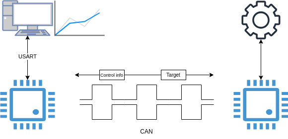
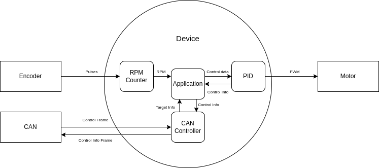
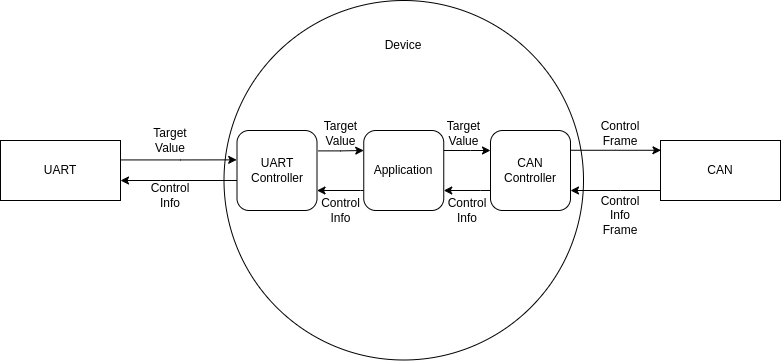
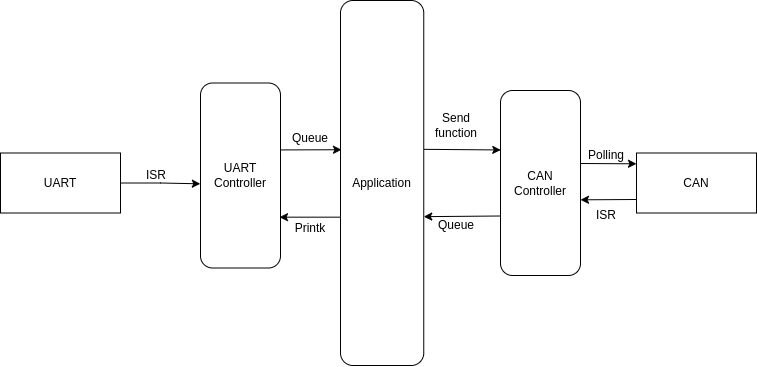

# Zephyr - Cruise Control

## Main Goal

1. Learn how to use Zephyr RTOS (The best way to do that is by coding and making mistakes).
2. Improve understanding of control systems, such as configuring sample rates and PID tuning.

## The Idea

The goal of this project is to create a velocity control system similar to the cruise control systems found in vehicles.

If you're driving at 60 km/h, you can send this speed value to the cruise control system, and the control algorithm will increase or decrease the vehicle's speed to maintain the target velocity.

# Project Specifications

## **Version 2** 

This project is built on Zephyr RTOS. The system consists of two separate controllers. One receives a target velocity value via UART and sends it to another controller through the CAN bus using an MCP2515 module. The other microcontroller receives the CAN Frame via another MCP2515, and sends the control Frame to a PID routine. The PID algorithm tries to reach and maintain the target velocity. For each iteration of the PID task, a control information Frame is sent back to the first microcontroller, which prints the values over the serial connection.

The figure below shows an overview of how the project works.

## **Architecture and Data flow**

Since the main idea of this project is learning, I’ve also implemented a simple architecture design for the code base.

The project has two modules that communicate over a CAN bus, so I’ve organized the project into two folders:

### **cruise_control** 

The Cruise Control module is responsible for receiving and processing incoming CAN frames, calculating and applying the control signal, and then sending an info Frame back through the CAN bus.

This module has two data inputs and four processes. Let's dive into the details:

1. **Inputs:**
    - **Encoder:** The encoder input will send pulses from a quadrature encoder.
    - **CAN:** The CAN input will send a control Frame over the bus with the target value.
2. **Process:**
    - **RPM Counter:** The RPM Counter process captures pulses from the encoder and converts the pulse count into an RPM value using the motor specifications to calculate the output shaft RPM.
    - **CAN Controller:** The CAN Controller process is responsible for capturing control frames, decoding them, and sending them to the application process. It also sends a control info Frame when the application process requires it.
    - **PID:** The PID process is a simple proportional-integral-derivative controller. This process calculates the error by subtracting the target value from the current value and computes a PWM output to be applied to the motor input.
    - **Application:** The Application process handles all the high-level logic. It essentially acts as a dispatcher, forwarding tasks to the other processes.

Now that we’ve covered the software architecture, let’s look at the data flow design:

For the inputs, all the data is collected using an ISR callback, and this data is forwarded to the application process over a queue. There is a separate queue for  the RPM Counter and another one for the CAN Controller. The application will read from these queues and compute the logic. If the data comes from the CAN Controller queue, the application will send the received value as the target to the PID process using a set function (essentially setting a static global variable in the PID module). If the data comes from the RPM Counter process, the application will also send the value to the PID process, but this time, it will set the current RPM value. Finally, if the application receives data from the PID queue, it means that it's a control info Frame, and the application will send this data to the CAN controller to be transmitted over the CAN bus.

### **interface** 

The interface module is responsible for receiving a target value through UART and sending this value as control Frame over the CAN bus.

This module has two data inputs and three processes. As we did in the first module, let's dive into the details:

1. **Inputs:**
    - **UART:** The UART input allows the user to select a target RPM value, that will be sent to the control device.
    - **CAN:** The CAN input sends a control info Frame over the bus.
2. **Process:**
    - **UART Controller:** The UART Controller is responsable to receive a valid number throug the UART and sending it to the Application.
    - **Application:** The Application will receive the data from both the UART and CAN controllers, process it, and send it to destination, acting as dispatcher.
    - **CAN Controller:** The CAN Controller will send a control Frame to the control device over the CAN bus and, when it receive a Control info Frames, it sends it to the Application process.

Now that we’ve covered the software architecture of the interface device, let’s look at the data flow design:

For the inputs, all the data is collected using an ISR callback, and this data is forwarded to the application process over a queue. The application will read from these queues and compute the logic. If the device receives a message from the UART queue, the Application process will send this value to the CAN Controller, which will then send a control Frame over the CAN bus. If the device receives a message from the CAN queue, the Application process will send the data to the UART Controller using the "printk" function (This part is 100% abstracted by the Zephyr kernel, but since it uses UART anyway, I think it's fine to include it this way).

