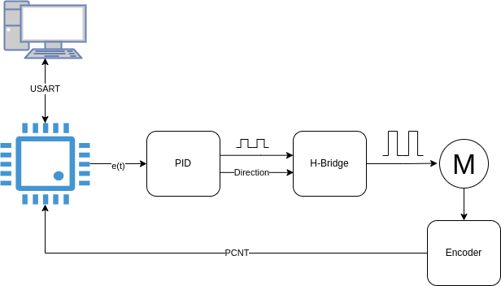

# Zephyr - Cruise Control

## Main Goal

1. Learn how to use Zephyr RTOS (The best way to do that is by coding and making mistakes).
2. Improve understanding of control systems, such as configuring sample rates and PID tuning.

## The Idea

The goal of this project is to create a velocity control system similar to the cruise control systems found in vehicles.

### Cruise Control

If you're driving at 60 km/h, you can send this speed value to the cruise control system, and the control algorithm will increase or decrease the vehicle's speed to maintain the target velocity.

## Project Specifications

The project is based on Zephyr RTOS. The system receives a target velocity value via UART and sends it to a PID routine, which tries to reach and maintain this value.

The plant controlled by the PID algorithm is a DC motor. Feedback data is provided by a quadrature encoder.

Since the system is not moving in real space, the measurement unit will be RPM (Revolutions Per Minute).

## Version 1

The image bellow shows a basic representation of the system.

